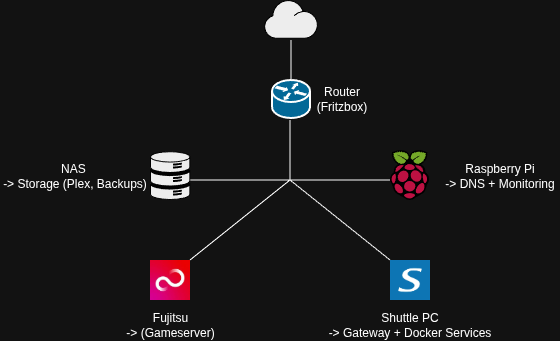

# 🧱 Architektur

## 🌐 Netzwerkübersicht

> 📌 Hinweis: Darstellung vereinfacht und anonymisiert

---

## 🖥️ Systeme im Überblick

Das Homelab besteht aus mehreren Geräten mit klar definierten Aufgaben:

### 🍓 Raspberry Pi 5

* DNS-Server (Pi-hole)
* Monitoring (Uptime Kuma)
* zentrale Infrastruktur-Dienste

---

### 🖥️ Shuttle PC

* zentrale Docker-Instanz
* Reverse Proxy (Traefik)
* Hosting der meisten Services

---

### 🎮 Fujitsu Mini PC

* dedizierter Gameserver
* getrennt vom restlichen System für bessere Performance

---

### 💾 NAS

* Speicherung von Medien (Plex)
* Backups und zentrale Datenablage

---

### 🌐 Router (Fritzbox)

* zentrale Netzwerkverbindung
* Verbindung zum Internet
* Basis der lokalen Infrastruktur

---

## 🎯 Ziel der Architektur

* klare Trennung der Aufgaben
* einfache Erweiterbarkeit
* zentrale Verwaltung über Docker
* übersichtliche Struktur der Systeme
